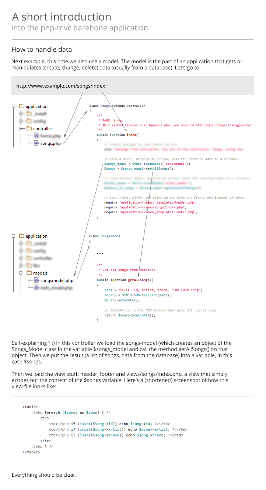
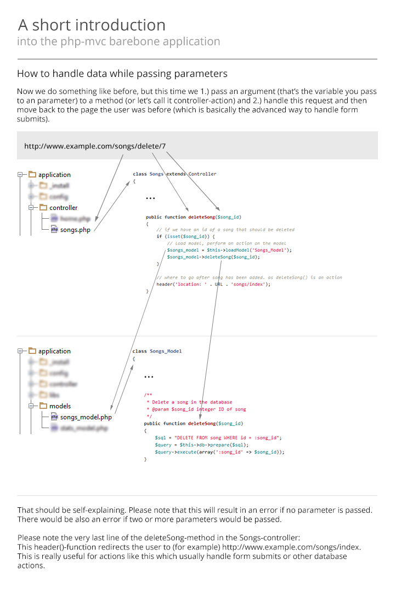

# PHP-MVC

An extremely simple and easy to understand MVC skeleton application, reduced to the max.
Everything is as simple as possible, as readable as possible and as manually as possible.
This project tries to be the extremely slimmed down opposite of big frameworks like Zend2, Symfony or Laravel.

## Why does this project exist ?

One of the biggest question in the PHP world is "How do I build an application ?".
It's hard to find a good base, a good file structure and useful information on that, but at the same time
there are masses of frameworks that might be really good, but really hard to understand, hard to use and extremely
complex. This project tries to be some kind of naked skeleton bare-bone for quick application building,
especially for the not-so-advanced coder.

### Goals of this project:

- give people a clean base MVC structure to build a modern PHP application with
- teach people the basics of the Model-View-Controller architecture
- encourage people to code according to PSR 1/2 coding guidelines
- promote the usage of PDO
- promote the usage of external libraries via Composer
- promote development with max. error reporting
- promote to comment code
- promote the usage of OOP code

## Contribute

Please commit into the develop branch (which holds the in-development version), not into master branch
(which holds the tested and stable version).

## Installation

First, copy this repo into a public accessible folder on your server.
Common techniques are a) downloading and extracting the .zip / .tgz by hand, b) cloning the repo with git or
c) getting the repo via Composer, you'll need to "require" this: `"panique/php-mvc": "dev-master"`!

1. Install mod_rewrite, for example by following this guideline:
[How to install mod_rewite in Ubuntu](http://www.dev-metal.com/enable-mod_rewrite-ubuntu-12-04-lts/)

2. Run the SQL statements in the *application/_install* folder.

3. Change the .htaccess file from
```
RewriteBase /php-mvc/
```
to where you put this project, relative to the web root folder (usually /var/www). So when you put this project into
the web root, like directly in /var/www, then the line should look like or can be commented out:
```
RewriteBase /
```
If you have put the project into a sub-folder, then put the name of the sub-folder here:
```
RewriteBase /sub-folder/
```

4. Edit the *application/config/config.php*, change this line
```php
define('URL', 'http://127.0.0.1/php-mvc/');
```
to where your project is. Real domain, IP or 127.0.0.1 when developing locally. Make sure you put the sub-folder
in here (when installing in a sub-folder) too, also don't forget the trailing slash !

5. Edit the *application/config/config.php*, change these lines
```php
define('DB_TYPE', 'mysql');
define('DB_HOST', '127.0.0.1');
define('DB_NAME', 'php-mvc');
define('DB_USER', 'root');
define('DB_PASS', 'mysql');
```
to your database credentials. If you don't have an empty database, create one. Only change the type `mysql` if you
know what you are doing.

## Add external libraries via Composer

To add external libraries/tools/whatever into your project in an extremely clean way, simply add a line with the
repo name and version to the composer.json! Take a look on these tutorials if you want to get into Composer:
[How to install (and update) Composer on Windows 7 or Ubuntu / Debian](http://www.dev-metal.com/install-update-composer-windows-7-ubuntu-debian-centos/)
and [Getting started with Composer](http://www.dev-metal.com/getting-started-composer/).

## Useful information

1. SQLite does not have a rowCount() method (!). Keep that in mind in case you use SQLite.

2. Don't use the same name for class and method, as this might trigger an (unintended) *__construct* of the class.
   This is really weird behaviour, but documented here: http://php.net/manual/en/language.oop5.decon.php

## A quickstart tutorial

You can also find these tutorial pictures in the *_introduction* folder.






## License

This project is licensed under the MIT License.
This means you can use and modify it for free in private or commercial projects.

The MIT License (MIT)

## Support / Donate

If you think this script is useful and saves you a lot of work, then think about supporting the project:

1. Donate via [PayPal](https://www.paypal.com/cgi-bin/webscr?cmd=_s-xclick&hosted_button_id=P5YLUK4MW3LDG) or [GitTip](https://www.gittip.com/Panique/)
2. Rent your next server at [A2 Hosting](http://www.a2hosting.com/4471.html) or [DigitalOcean](https://www.digitalocean.com/?refcode=40d978532a20).
3. Contribute to this project. Feel free to improve this project with your skills.
4. Spread the word: Tell others about this project.

## Statistics (by BitDeli)

[](https://bitdeli.com/free "Bitdeli Badge")
