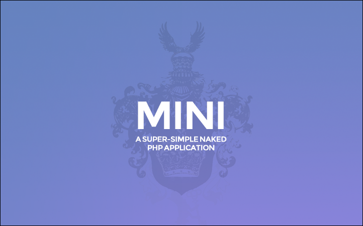

# MINI

MINI is an extremely simple and easy to understand skeleton PHP application, reduced to the max.
MINI is NOT a professional framework and it does not come with all the stuff real frameworks have.
If you just want to show some pages, do a few database calls and a little-bit of AJAX here and there, without
reading in massive documentations of highly complex professional frameworks, then MINI might be very useful for you.
MINI is easy to install, runs nearly everywhere and doesn't make things more complicated than necessary.

## Features

- extremely simple, easy to understand
- encourages people to code according to PSR 1/2 coding guidelines
- promotes the usage of PDO
- promotes the usage of external libraries via Composer
- promotes development with max. error reporting
- promotes to comment code
- uses only native PHP code, so people don't have to learn a framework

## Requirements

- PHP 5.3.0+
- MySQL
- mod_rewrite activated (tutorials below)

## Installation

1. Edit the database credentials in `application/config/config.php`
2. Execute the .sql statements in the `_installation/`-folder (with PHPMyAdmin for example).
3. Make sure you have mod_rewrite activated on your server / in your environment. Some guidelines:
   [Ubuntu 14.04 LTS](http://www.dev-metal.com/enable-mod_rewrite-ubuntu-14-04-lts/),
   [Ubuntu 12.04 LTS](http://www.dev-metal.com/enable-mod_rewrite-ubuntu-12-04-lts/),
   [EasyPHP on Windows](http://stackoverflow.com/questions/8158770/easyphp-and-htaccess),
   [AMPPS on Windows/Mac OS](http://www.softaculous.com/board/index.php?tid=3634&title=AMPPS_rewrite_enable/disable_option%3F_please%3F),
   [XAMPP for Windows](http://www.leonardaustin.com/blog/technical/enable-mod_rewrite-in-xampp/),
   [MAMP on Mac OS](http://stackoverflow.com/questions/7670561/how-to-get-htaccess-to-work-on-mamp)

MINI runs without any further configuration.

## When installing in a sub-folder

In case you run the script inside a sub-folder: Then the AJAX-calls will not work by default. To fix this, you'll need
to add the folder's name to all paths in AJAX-calls in the `public/js/application.js`. This will be fixed in future
versions.

## Security

The script makes use of mod_rewrite and blocks all access to everything outside the /public folder.
Your .git folder/files, operating system temp files, the application-folder and everything else is not accessible
(when set up correctly).

## License

This project is licensed under the MIT License.
This means you can use and modify it for free in private or commercial projects.

## Support

If you want to support MINI, then rent your next server at
[A2Hosting](https://affiliates.a2hosting.com/idevaffiliate.php?id=4471&url=579).

## History

MINI is the successor of php-mvc. As php-mvc didn't provide a real MVC structure (and several people complained
about that - which is totally right!) I've renamed and rebuild the project.

## Dear haters, trolls and i-hate-everything-people...

... MINI is just a simple helper-tool I've created for my daily work, simply because it was much easier to setup and
handle than real frameworks. For daily agency work, quick prototyping and frontend-driven projects it's totally okay.

I've written this unpaid, voluntarily, in my free-time and uploaded it on GitHub to share.
It's totally free, for private and commercial use. If you don't like it, don't use it.
If you see issues, then write a ticket (and if you are really cool: commit
a fix!). But don't bash, don't complain, don't hate. There's no reason to do so.

## Contribute

Please commit into the develop branch (which holds the in-development version), not into master branch
(which holds the tested and stable version).

## Support / Donate

If you think this script is useful and saves you a lot of work, then think about supporting the project:

1. Donate via [PayPal](https://www.paypal.com/cgi-bin/webscr?cmd=_s-xclick&hosted_button_id=P5YLUK4MW3LDG),
   [GitTip](https://www.gittip.com/Panique/) or
   [Flattr](https://flattr.com/submit/auto?user_id=panique&url=https%3A%2F%2Fgithub.com%2Fpanique%2Fmini).
2. Rent your next server at [A2 Hosting](https://affiliates.a2hosting.com/idevaffiliate.php?id=4471&url=579).
3. Contribute to this project. Feel free to improve this project with your skills.

## Changelog

**November 2014**
- [panique] removed all "models", using one model file now
- [panique] full project renaming, re-branding

**October 2014**
- [tarcnux/panique] PDO debugging
- [panique] demo ajax call
- [panique] better output escaping
- [panique] renamed /libs to /core
- [tarcnux] basic CRUD (create/read/update/delete) examples have now an U (update)
- [panique] URL is now config-free, application detects URL and sub-folder
- [elysdir] htaccess has some good explanation-comments now
- [bst27] fallback for non-existing controller / method
- [panique] fallback will show error-page now
- [digitaltoast] URL split fix to make php-mvc work flawlessly on nginx
- [AD7six] security improvement: moved index.php to /public, route ALL request to /public

**September 2014**
- [panique] added link to support forum
- [panique] added link to Facebook page

**August 2014**
- [panique] several changes in the README, donate-button changes

**June 2014**
- [digitaltoast] removed X-UA-Compatible meta tag from header (as it's not needed anymore these days)
- [digitaltoast] removed protocol in jQuery URL (modern way to load external files, making it independent to protocol change)
- [digitaltoast] downgraded jQuery from 2.1 to 1.11 to avoid problems when working with IE7/8 (jQuery 2 dropped IE7/8 support)
- [panique] moved jQuery loading to footer (to avoid page render blocking)

**April 2014**
- [panique] updated jQuery link to 2.1
- [panique] more than 3 parameters (arguments to be concrete) are possible
- [panique] cleaner way of parameter handling
- [panique] smaller cleanings and improvements
- [panique] Apache 2.4 install information

**January 2014**
- [panique] fixed .htaccess issue when there's a controller named "index" and a base index.php (which collide)
