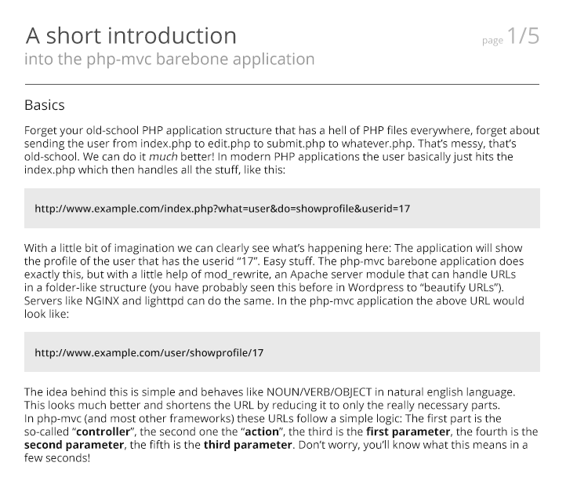
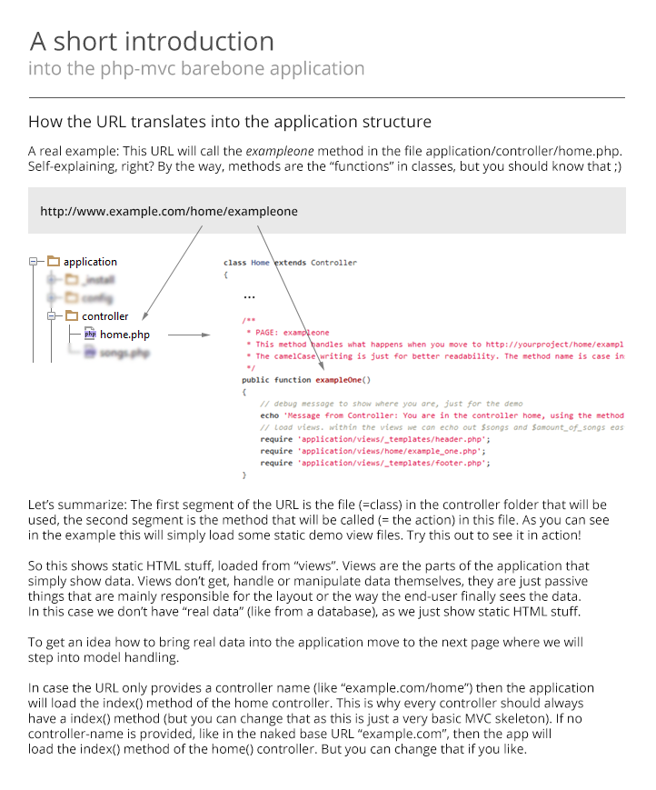
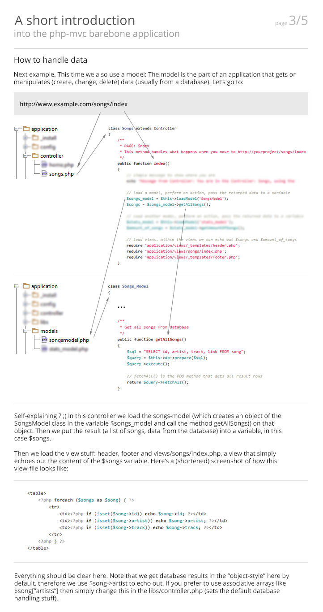
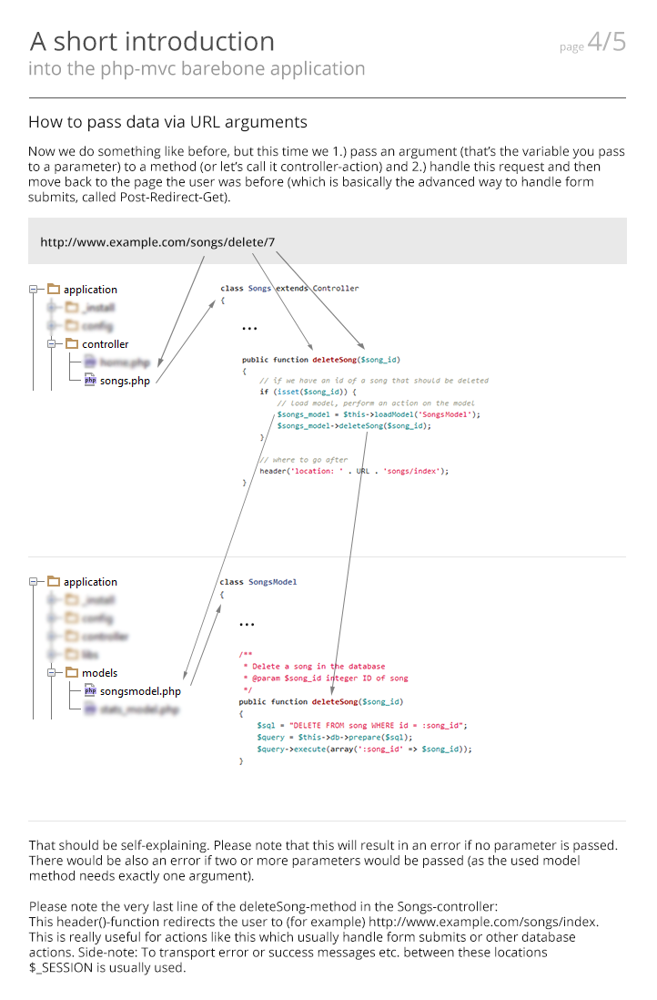
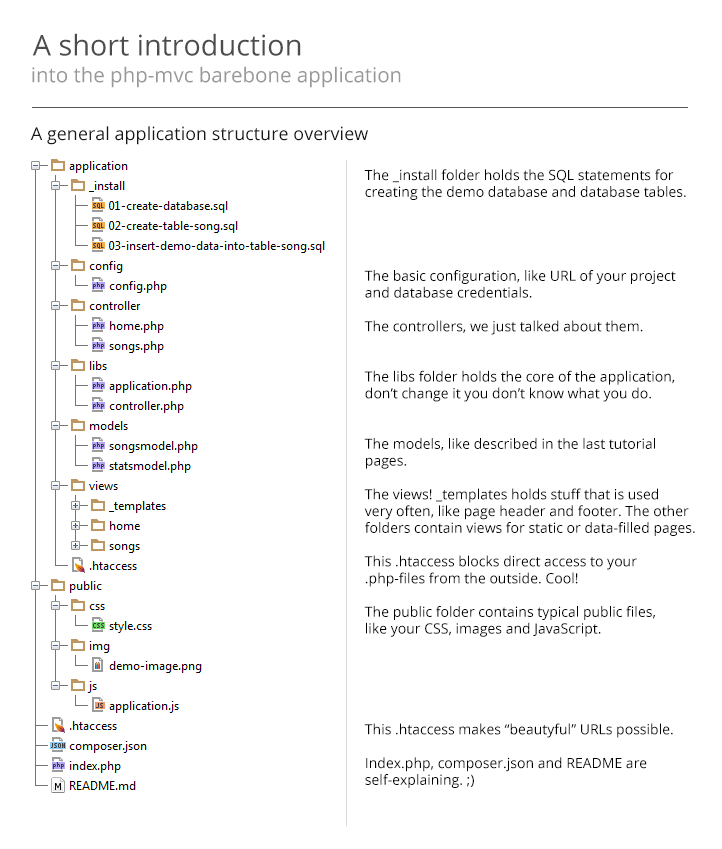

# PHP-MVC

An extremely simple and easy to understand MVC skeleton application,
reduced to the max. Everything is **as simple as possible**, **as
manually written as possible**, and as readable as possible. This
project is--by intention--NOT a full framework; it's a bare-bones
structure, written in purely native PHP! The php-mvc skeleton tries to
be the extremely slimmed down opposite of big frameworks like Zend2,
Symfony, or Laravel.

[](https://affiliates.a2hosting.com/idevaffiliate.php?id=4471&url=579)

## Basic and Advanced versions

This is the basic version. There's an [advanced
version](https://github.com/panique/php-mvc-advanced) in development
that has additional features, currently Twig and SASS. More to come!
Have a look.

## Why does this project exist ?

One of the biggest questions in the PHP world is "How do I build an
application?" It's hard to find a good base, a good file structure,
and useful information; but at the same time, there are masses of
frameworks that might be really good, but really hard to understand,
hard to use, and extremely complex. This project tries to be a kind of
naked bare-bones skeleton for quick application building, especially
for the not-so-advanced coder.

### Goals of this project:

- Give people a clean base MVC structure to build a modern PHP application with.
- Teach people the basics of the Model-View-Controller architecture.
- Encourage people to code according to PSR 1/2 coding guidelines.
- Promote the use of PDO.
- Promote the use of external libraries via Composer.
- Promote development with maximum error reporting.
- Promote commenting in code.
- Promote the use of object-oriented programming.
- Use only native PHP code, so people don't have to learn a framework.

## Support forum

If you are stuck even AFTER reading and following the install
tutorials and the quick-manual, then feel free to ask in the [official
forum](http://forum.php-mvc.net/). Note that this forum is fresh and
new; more content will come over time.

## Keep on track with development by following ...

... [on
Facebook](https://www.facebook.com/pages/The-PHP-MVC-Project/1488883564703966),
or check this GitHub repo.

## Installation

### On Windows 7 (with EasyPHP)

There's a tutorial on [How to install php-mvc on Windows 7, 8 and
8.1](http://www.dev-metal.com/install-php-mvc-windows-7/).

### On Ubuntu 12.04 LTS

Ubuntu 12.04 LTS is the most common mainstream server operating
system. Unless you know what you're doing and have a very good reason
to use something else: Use this version!

First, copy this repo into a publicly accessible folder on your
server. Common techniques are a) downloading and extracting the .zip /
.tgz by hand, or b) cloning the repo with git (into var/www).

```
git clone https://github.com/panique/php-mvc.git /var/www
```

or c) getting the repo via Composer (copying into var/www)

```
composer create-project panique/php-mvc /var/www dev-master
```

1. Install mod_rewrite, for example by following this guideline: [How
to install mod_rewrite in
Ubuntu](http://www.dev-metal.com/enable-mod_rewrite-ubuntu-12-04-lts/).

2. Run the SQL statements in the *application/_install* folder (after
modifying them to use the name of your database if necessary).

3. Change the .htaccess file from
```
RewriteBase /php-mvc/
```
to where you put this project, relative to the web root folder
(usually /var/www). So when you put this project into the web root,
like directly in /var/www, then the line should look like the
following, or can be commented out:
```
RewriteBase /
```
If you have put the project into a subfolder, then put the name of the
subfolder here:
```
RewriteBase /subfolder/
```

4. Edit the *application/config/config.php* file to change this line:
```php
define('URL', 'http://127.0.0.1/php-mvc/');
```
to where your project is--your real domain URL, your IP address, or
127.0.0.1 when developing locally. Don't forget the trailing slash!
And if you're installing in a subfolder instead of your web root, then
include the subfolder in this URL.

5. Edit the *application/config/config.php* file to change these lines:
```php
define('DB_TYPE', 'mysql');
define('DB_HOST', '127.0.0.1');
define('DB_NAME', 'php-mvc');
define('DB_USER', 'root');
define('DB_PASS', 'mysql');
```
to your database credentials. If you don't have an empty database,
create one. Don't change the type `mysql` unless you know what you are
doing.

### On Ubuntu 14.04 LTS

Ubuntu 14.04 LTS comes with a newer version of Apache (2.4) that has
slightly different configs and config syntax, and different filenames.
Here's a tutorial on [how to enable mod_rewrite in Ubuntu 14.04
LTS](http://www.dev-metal.com/enable-mod_rewrite-ubuntu-14-04-lts/).
To update the application itself for Ubuntu 14.04 LTS, change
`application/.htaccess` to `Require all denied`. For more details, see
the [official Apache
docs](http://httpd.apache.org/docs/2.4/upgrading.html). Thanks to
*adamholte* for the info!

## A quickstart tutorial

You can also find these tutorial pictures in the *_tutorial* folder.







## You like what you see ?

Then please also have a look at...

#### My php-login project

A collection of four similar login scripts for PHP, from a
super-simple one-file script using SQLite to a highly professional MVC
frameworks solution. All scripts use the most advanced hashing
algorithms possible in PHP, exactly like the PHP core developers want
you to use them.

https://github.com/panique/php-login (full MVC framework)

https://github.com/panique/php-login-minimal (minimal)

https://github.com/panique/php-login-advanced (advanced)

https://github.com/panique/php-login-one-file (one-file)

#### My PHP and frontend blog

Lots of non-boring development stuff and tutorials there.

http://www.dev-metal.com

## Useful information

1. SQLite does not have a rowCount() method (!). Keep that in mind in
case you use SQLite.

2. Don't use the same name for class and method, as this might trigger
an (unintended) *__construct* of the class. This is really weird
behaviour, but documented on php.net: [Constructors and
Destructors](http://php.net/manual/en/language.oop5.decon.php).

## Add external libraries via Composer

To add external libraries/tools/whatever into your project in an
extremely clean way, simply add a line with the repo name and version
to the composer.json! If you want to get into Composer, take a look at
these tutorials:
[How to install (and update) Composer on Windows 7 or Ubuntu / Debian](http://www.dev-metal.com/install-update-composer-windows-7-ubuntu-debian-centos/)
and [Getting started with Composer](http://www.dev-metal.com/getting-started-composer/).

## License

This project is licensed under the MIT License.
This means you can use and modify it for free in private or commercial
projects.

## Contribute

Please commit into the **develop branch** (which holds the
in-development version), not into master branch (which holds the
tested and stable version).

## Support / Donate

If you think this script is useful and saves you a lot of work, then
think about supporting the project:

A. Donate via [PayPal](https://www.paypal.com/cgi-bin/webscr?cmd=_s-xclick&hosted_button_id=P5YLUK4MW3LDG), [GitTip](https://www.gittip.com/Panique/) or [Flattr](https://flattr.com/submit/auto?user_id=panique&url=https%3A%2F%2Fgithub.com%2Fpanique%2Fphp-mvc).
B. Rent your next server at [A2 Hosting](http://www.a2hosting.com/4471.html) or [DigitalOcean](https://www.digitalocean.com/?refcode=40d978532a20).
C. Contribute code to this project on GitHub.
D. Spread the word: Tell others about this project.

## Linked music tracks in the demo application

The linked tracks in this naked application are just some of my
personal favourites of the last few months. I think it's always a good
idea to fill boring nerd-code stuff with quality culture.
