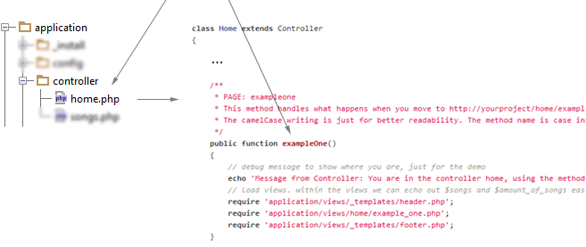

A Short Introduction into the php-mvc barebone application
===========

Basics
-----
Forget your old-school PHP application structure that has a hell of PHP files everwhere, forget about sending the user from ```index.php``` to ```edit.php```to ```submit.php```. That's messy, that's old-school. We can do it *much* better ! Ind modern PHP applications users basically juste hists the ```index.php``` which then handles all the stuff, like this :

```
http://www.example.com/index.php?what=user&do=showprofile&userid=17
```

With a little bit of imagination we can clearly see what's happenning here: The application wil show the profile of the user that has the userid "17". Easy stuff. The **php-mvc barebone application** does exactly this, but with a tittle help of *mod_rewrite*, an Apache serveur module that can handle URLs in a folder-like structure (you have probably seen this before in Wordpress to "beautify URLs"). Servers like NGINX and lighttpd ca do the same. In the **php-mvc application** the above URL wold look like : 

```
http://www.example.com/user/showprofile/17
```

The idea behind this is simple and behaves like NOUN/VERB/OBJECT in natural english language. This looks much better and shortens the URL by reducing it to only the really necessary parts. In **php-mvc** (and most other frameworks) these URLS follow a simple logic: The first part is the so-called "**controller**", the second on the "**action**", the third is the **first parameter**, the fourth is the **second parameter**, the fifth is the third parameter. Dont't worry, you'll know what this means in a few seconds !


How the URL translates into the application structure
--------
A real example: This URL will call the *exampleone* methid in the file ```application/controller/home.php```. Self-explaining, right ? By the way, methods are the "functions" in classes, but you should know that ;)

```
http://www.example.com/home/exampleone
```

