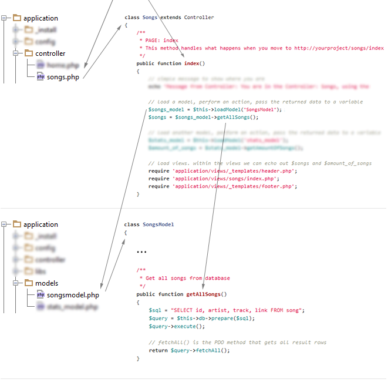

A Short Introduction into the php-mvc barebone application
===========

Basics
--------
Forget your old-school PHP application structure that has a hell of PHP files everwhere, forget about sending the user from ```index.php``` to ```edit.php``` to ```submit.php```. That's messy, that's old-school. We can do it *much* better ! In modern PHP applications users basically juste hits the ```index.php``` which then handles all the stuff, like this :

```
http://www.example.com/index.php?what=user&do=showprofile&userid=17
```

With a little bit of imagination we can clearly see what's happenning here: The application will show the profile of the user that has the userid "17". Easy stuff. The **php-mvc barebone application** does exactly this, but with a little help of *mod_rewrite*, an Apache serveur module that can handle URLs in a folder-like structure (you have probably seen this before in Wordpress to "beautify URLs"). Servers like NGINX and lighttpd can do the same. In the **php-mvc application** the above URL would look like : 

```
http://www.example.com/user/showprofile/17
```

The idea behind this is simple and behaves like NOUN/VERB/OBJECT in natural english language. This looks much better and shortens the URL by reducing it to only the really necessary parts. In **php-mvc** (and most other frameworks) these URLS follow a simple logic: The first part is the so-called "**controller**", the second on the "**action**", the third is the **first parameter**, the fourth is the **second parameter**, the fifth is the third parameter. Don't worry, you'll know what this means in a few seconds !


How the URL translates into the application structure
--------
A real example: This URL will call the *exampleone* method in the file ```application/controller/home.php```. Self-explaining, right ? By the way, methods are the "functions" in classes, but you should know that ;)

```
http://www.example.com/home/exampleone
```


Let's summarize: The first segment of the URL is the file (=class) in the controller folder that will be used, the second segment is the method that will be called (=the action) in this file. As you can see in the example this will simply load some static demo view files. 
**Try this out to see it in action !**

So this shows static HTML stuff, loaded from "views". Views are the parts of the application that simply show data. Views don't get, handle or manipulate data themselves, they are juste passive things that are mainly responsible for the layout or the way the end-user finally sees the data. In this case we don't have "real data" (like from a database), as we just show static HTML stuff.

To get an idea how to bring real data into the application move to the next page where we will step into model handling.

In case the URL only provides a controller name (like "example.com/home") then the application will load the ```index()``` method of the home controller. This is why every controller should always have a ```index()``` method (but you can change that as this is just a very basic MVC skeleton). If no controller-name is provided, like in the naked base URL "example.com", then the app will load the ```index()``` method of the home controller. But you can change that if you like.


How to handle data
--------
Next example. This time we also use a model: The model is the part of an application that gets or manipulates (create, change, delete) data (usually from a database). Let's go to :

```
http://www.example.com/songs/index
```


Self-explaining ? ;) In this controller we load the songs-model (which creates an object of the SongsModel class) in the variable ```$songs_model``` and call the method ```getAllSongs()``` on that object. Then we put the result (a list of songs, data from the database) into a variable, in this case $songs.

Then we load the view stuff: header, footer and ```views/songs/index.php```, a view that simply echoes out the content of the ```$songs``` variable. Here's (shortened) example of how this view-file looks like:

```html
<table>
	<?php foreach ($songs as $song) { ?>
		<tr>
			<td><?php if (isset($song->id)) echo $song->id; ?></td>
			<td><?php if (isset($song->artist)) echo $song->id; ?></td>
			<td><?php if (isset($song->track)) echo $song->track; ?></td>
		</tr>
	<?php } ?>
</table>
```

Everything should be clear here. Note that we get database results in the "object-style" here by default, therefore we use ```$song->artist``` to echo out. If you prefer to use associative arrays like ```$song["artists"]``` then simply change this in the ```libs/controller.php``` (sets the default database handling stuff).


How to pass data via URL arguments
--------

Now we do something like before, but this time we 1.) pass an argument (that's the variable you pass to a parameter) to a method (or let's call it controller-action) and 2.) handle this request and then move back to the page the user was before (which is basically the advanced way to handle form submits, called Post-Redirect-Get).

```
http://www.example.com/songs/index
```


That sould be self-explaining. Please note that this will result in an error if no parameter is passed. There would be also an error if two or more parameters be passed (as the used model method needs exactly one argument).

Please note the very last line of the deleteSong-method in the Songs-controller: This header()-function redirects the user to (for example) http://www.example.com/songs/index.
This is really useful for actions like this which usually handle form submits or other database actions. Side-note: To transport error or success messages etc. between these locations ```$_SESSION``` is usually used.


A general application structure overview
--------


- **_install**/ : Folder holds the SQL statements for creating the demo database / database tables.
- **config/** : The base configuration, like URL of your project and database credentials.
- **controller/** : The controllers, we just talked about them.
- **libs/** : The libs folder holds the core of the application, don't change it you don't know what you do.
- **models/** : Application models to manage data. 
- **views/** : The views ! *_templates* holds stuff that is used very often, like page header and footer. The other folders contain views for static or data-filled pages.
- **application/.htaccess** : Blocks direct access to your .php-files from the outside. Cool!
- **public/** : Contains typical public files, like your CSS, images, and JavaScript.
- **/.htaccess** : Makes "beautiful URLS" possible.
- **index.php, composer.json, README.md** : Are self-explaining ;)


